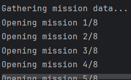

# MissionChief Bot

This is a MissionChief bot that automates the process of logging into your account and completing your missions using the Chromium driver.

# IN ORDER FOR THE BOT TO LOAD ALL VEHICLES IT WAITS 30s, SCROLL ON YOUR VEHICLES WINDOW SLOWLY SO IT DETECTS ALL YOUR VEHICLES.

# Functions

1. Only dispatch to non in-progress misions (green)
2. Dispatch vehicles to missions
3. Transport Patients from missions to one of your hospitals
4. Transport Prisoners to one of your jails
5. Automatically dispatches Wrecker or Flatbed Carrier based on Crashed cars in a mission
6. Automatically dispatches a Prisoner Transport Van if the amount of prisoners is greater than 1
6. Credit Updater that shows how many credits you will earn
7. Runs every 3 minutes and only redispatches units to missions that don't already have units


## Prerequisites

Before running the bot, make sure you have the following installed:

- Python 3.x
- Selenium library
- Chrome driver (download and set the path in your code)

## Installation

1. Clone this repository or download the code.
2. Install the required Python dependencies by running `pip install -r requirements.txt` in the project directory.

## Configuration

1. Modify the `config.ini` file in the project directory and fill in the following:

```ini
[credentials]
username = your_username
password = your_password
Replace your_username and your_password with your actual MissionChief credentials.
```
## Usage
1. Open a terminal or command prompt and navigate to the project directory.

2. Run the bot by executing `python main.py`.

3. The bot will log into your MissionChief account and start completing your missions.

4. In order to update your list of vehicles, delete the vehicle_data.py

# Bot in Action:



# After 30m: 


## Known Bugs
1. TowTrucks not being dispatched (Since this is a new vehicle give me some time to update the dispatch logic for it)
2. Headless Causes Vehicles not to dispatch

# Need Support?
Well visit this linktree link and join my discord for any questions or support! https://linktr.ee/honorablenate

# Disclaimer
Please note that using automation tools to interact with websites may violate the terms of service of MissionChief. Make sure to use this bot responsibly and in compliance with the website's policies.